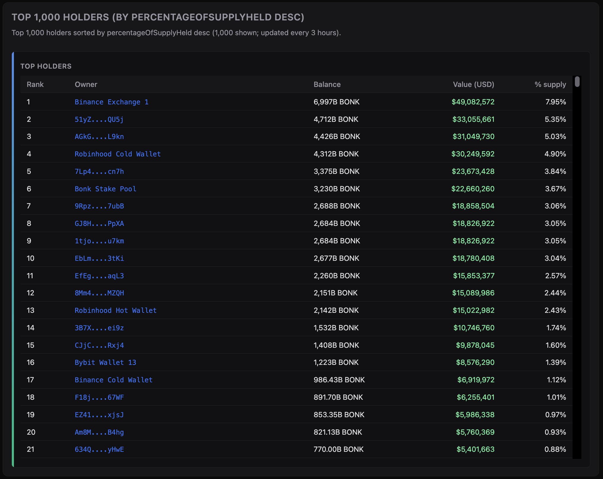
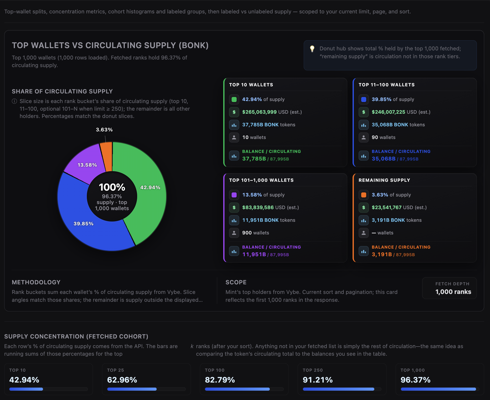
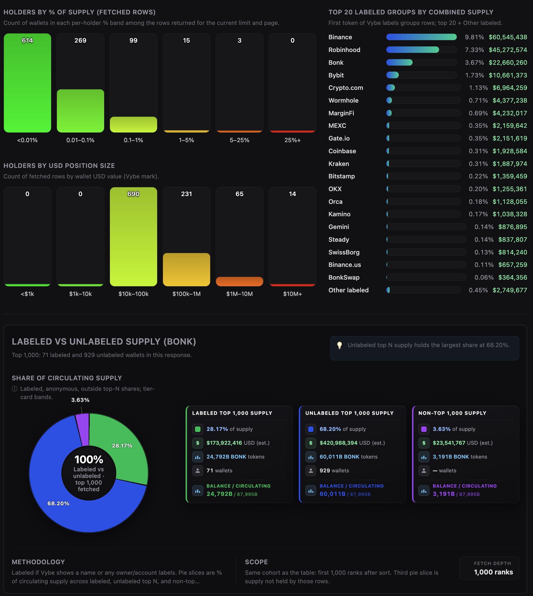

# Solana Top Token Holders & Whales API

This repository demonstrates how to use the Vybe Solana **Top Holders** API to fetch, visualize, and export *who owns what* for any SPL or Token-2022 token. It includes a production-ready Node.js backend and a modern, framework-free frontend that show how to:

- Fetch **token metadata** (symbol, name, supply, market cap, update time)
- Fetch **top holders** with pagination and sorting
- Compute **cohort concentration** metrics and distributions
- Group **labeled entities** (Vybe names/labels) into rollups
- Pull **recent trades** and **top traders** as optional context

Try the live demo: https://solana-top-token-holders-and-whales-api.vybenetwork.com

Use this project as a reference implementation or starter kit for building Solana holder dashboards, token distribution explorers, whale-monitoring tools, and compliance/forensics workflows powered by Vybe’s high-performance Solana data APIs.



<p align="center">
  
  
</p>

---

**[Try the LIVE demo →](https://solana-top-token-holders-and-whales-api.vybenetwork.com)**

**[Get your free Vybe API key →](https://vybenetwork.com/pricing)**  

**[Vybe Top Holders docs →](https://docs.vybenetwork.com/reference/get_top_holders_v4)**

---

## Prerequisites

- **Node.js** ≥ 20 (LTS recommended)
- **npm** ≥ 10 (or equivalent)

## Quick Start

Get from clone to running app in a few commands:

```bash
git clone https://github.com/vybenetwork/solana-top-token-holders-and-whales-api.git
cd solana-top-token-holders-and-whales-api
npm install
cp .env.example .env
# Edit .env and set VYBE_API_KEY=your_api_key_here
npm start
```

Then open **http://localhost:3000**, enter a token mint, and click **Load Holders & Whales**.

## Environment Variables

| Variable | Required | Description | Example |
|---|---:|---|---|
| `VYBE_API_KEY` | Yes | Vybe API key used for all Vybe requests | `your_api_key_here` |
| `SOLANA_RPC_URL` | No | Solana RPC used for Metaplex symbol fallback (defaults to mainnet-beta) | `https://api.mainnet-beta.solana.com` |
| `PORT` | No | HTTP server port | `3000` |
| `TUNNEL` | No | Set to `1` to run behind a Cloudflare Tunnel (requires `cloudflared`) | `1` |
| `TRADES_LOG` | No | Set to `1` to log `/api/trades` request URLs to `trades-requests.log` | `1` |

Get your API key at `https://vybenetwork.com/pricing`.

---

## What This Repo Provides

- **Vybe API proxy server**
  - Express server that proxies Vybe endpoints (keeps API key server-side) and serves the frontend from `public/`.
  - Endpoints exposed by this app:
    - `GET /api/tokens/:mint` (token metadata)
    - `GET /api/tokens/:mint/top-holders` (top holders)
    - `GET /api/trades` (recent trades for the mint)
    - `GET /api/programs/labeled-program-account?programAddress=...` (single program label lookup; cached)
    - `POST /api/programs/labeled-program-accounts` (batch program label lookup; cached)
    - `GET /api/wallets/top-traders` (optional context)
    - `GET /api/token-symbol/:mint` and `POST /api/token-symbols` (symbol fallback; cached)
- **Top holders web UI**
  - Single-page GUI (no frameworks) built from `src/frontend/app.ts` into `public/app.js`.
  - Lets you inspect holder distribution, concentration metrics, labeled entity rollups, and the top-holders table for any mint.
- **On-disk caches**
  - JSON caches stored in `data/`:
    - `data/symbol-cache.json`
    - `data/program-label-cache.json`

All of this uses Vybe’s production data across SPL + Token-2022 mints.

---

### Solana API docs for these endpoints

- **Top holders (`GET /v4/tokens/{mintAddress}/top-holders`)**:
  - [https://docs.vybenetwork.com/reference/get_top_holders_v4](https://docs.vybenetwork.com/reference/get_top_holders_v4)
- **Token details (`GET /v4/tokens/{mintAddress}`)**:
  - [https://docs.vybenetwork.com/reference/get_token_details_v4](https://docs.vybenetwork.com/reference/get_token_details_v4)
- **Historical trades (`GET /v4/trades`)**:
  - [https://docs.vybenetwork.com/reference/get_trade_data_program_v4](https://docs.vybenetwork.com/reference/get_trade_data_program_v4)
- **Labeled programs (`GET /v4/programs/labeled-program-accounts`)**:
  - [https://docs.vybenetwork.com/reference/get_known_program_accounts_v4](https://docs.vybenetwork.com/reference/get_known_program_accounts_v4)
- **Top traders (`GET /v4/wallets/top-traders`)**:
  - [https://docs.vybenetwork.com/reference/get_top_traders_v4](https://docs.vybenetwork.com/reference/get_top_traders_v4)

---

## Why Top Holders / Whale Data Matters

Top-holder and whale distribution data is critical for:

- **Risk & concentration**: identify tokens dominated by a small set of wallets.
- **Token launches & monitoring**: track the emergence (and exit) of whales over time.
- **Entity intelligence**: group labeled wallets (CEXs, market makers, team wallets) to understand true ownership.
- **Compliance & forensics**: quickly highlight clusters for deeper investigation.

This repo shows how to build a **practical holder explorer** on top of Vybe’s `top-holders` endpoint, with supporting metadata and labeling.

---

## Frontend Overview (Top Holders Dashboard)

The UI is implemented in `src/frontend/app.ts` and compiled to `public/app.js` via `npm start` (which runs `npm run build:frontend` first).

### Sections

- **Remote filters**
  - Mint address, sort direction, limit/page controls.
  - Fetches a top-holders page from `GET /api/tokens/:mint/top-holders`.
- **Token metadata header**
  - Symbol, name, last updated, price/market cap/supply where available (from `GET /api/tokens/:mint`).
  - Falls back to Metaplex-based symbol lookup via `/api/token-symbol/:mint` when needed.
- **Supply & holder charts**
  - **Top wallets vs circulating supply** donut and tier cards.
  - **Supply concentration** (fetched cohort) metrics + Gini-style score.
  - **Cohort distribution & labeled groups**: per-holder % histogram, USD histogram, and top labeled groups (first-token grouping).
  - **Labeled vs unlabeled supply**: donut and tier cards within the fetched cohort.
- **Top holders table**
  - One row per holder: rank, owner name/address, balance, USD value estimate, % of supply.

### Value formatting rules (holder dashboards)

- **Large values**: compact \(K/M/B\) formatting; when the coefficient exceeds 999, decimals are dropped and thousands separators are shown (e.g. `37,503B`).
- **Commas**: integer displays use `en-US` thousands separators.

---

## Server Proxy Routes

The Express server in `src/server.ts` exposes:

- **`GET /api/tokens/:mint`**
  - Proxies Vybe token details for the header.
- **`GET /api/tokens/:mint/top-holders`**
  - Proxies Vybe top holders with limit/page and sort.
- **`GET /api/trades`**
  - Proxies Vybe trades (mintAddress required; limit/page/timeStart/timeEnd supported).
- **`GET /api/programs/labeled-program-account`**
  - Single program label lookup (cached).
- **`POST /api/programs/labeled-program-accounts`**
  - Batch program label lookup (cached).
- **`GET /api/wallets/top-traders`**
  - Optional context: top traders for a mint at a resolution (default `30d`).
- **`GET /api/token-symbol/:mint`** and **`POST /api/token-symbols`**
  - Symbol resolution and batch symbol cache warmup.

All Vybe requests use a shared client (`src/api/index.ts`) with timeouts, retries, and consistent error formatting (`toHumanReadableError`).

---

## How to Run

### 1. Clone the repository

```bash
git clone https://github.com/vybenetwork/solana-top-token-holders-and-whales-api.git
cd solana-top-token-holders-and-whales-api
```

### 2. Install dependencies

```bash
npm install
```

### 3. Set your API key

```bash
cp .env.example .env
# Add your VYBE_API_KEY to .env
```

### 4. Run the server + web app

```bash
npm start
```

Then open **http://localhost:3000** and load a token mint.

### 5. (Optional) Run with Cloudflare Tunnel

To expose the app on a public URL (e.g. for sharing or testing from another device), you can enable a tunnel (requires `cloudflared` installed):

```bash
TUNNEL=1 npm start
```

The console prints a Cloudflare Tunnel URL when available.

---

## Project Structure

```text
solana-top-token-holders-and-whales-api/
├── .env.example
├── package.json
├── tsconfig.json
├── tsconfig.frontend.json
├── README.md
├── screenshots/                 # Screenshots referenced in this README (you update these)
├── public/                      # Web GUI (HTML, CSS, built JS)
│   ├── index.html
│   ├── app.css
│   └── app.js                   # Generated by `npm run build:frontend` from src/frontend/app.ts
├── dist/                        # Backend build output (`npm run build`)
└── src/
    ├── server.ts                # Express server; proxies Vybe API and serves public/
    ├── config.ts                # Env loading, API base URL, timeouts, PUBLIC_DIR
    ├── cache.ts                 # On-disk caches in data/
    ├── types/
    │   └── api.ts               # Interfaces matching Vybe API response shapes
    ├── api/
    │   ├── index.ts             # createClient(apiKey) — wires all API methods
    │   ├── client.ts            # Axios wrapper, retries, human-readable errors
    │   ├── tokens.ts            # GET /v4/tokens/{mintAddress}
    │   ├── holders.ts           # GET /v4/tokens/{mintAddress}/top-holders
    │   ├── trades.ts            # GET /v4/trades + programs + top traders
    │   └── token-symbol.ts      # Metaplex + hardcoded WSOL/USDC symbol fallback
    └── frontend/
        └── app.ts               # Holders dashboard UI → builds to public/app.js
```

---

## Direct API Usage Example

If you want to bypass the UI and fetch top holders using Vybe directly:

```typescript
import axios from 'axios';

const API = 'https://api.vybenetwork.xyz';
const headers = { 'X-API-KEY': process.env.VYBE_API_KEY!, Accept: 'application/json' };

type Holder = {
  rank?: number;
  ownerAddress?: string;
  ownerName?: string;
  balance?: string | number;
  valueUsd?: number;
  percentageOfSupplyHeld?: number;
};

async function fetchTopHolders(mintAddress: string, limit = 1000, page = 0) {
  const { data } = await axios.get<{ data: Holder[] }>(`${API}/v4/tokens/${mintAddress}/top-holders`, {
    params: { limit, page, sortByDesc: 'percentageOfSupplyHeld' },
    headers,
  });
  return data.data || [];
}

const mint = 'DezXAZ8z7PnrnRJjz3wXBoRgixCa6xjnB7YaB1pPB263';
fetchTopHolders(mint, 1000, 0).then((holders) => {
  console.log('top holders:', holders.length);
  console.log('first row:', holders[0]);
});
```

---

## Troubleshooting

| Issue | What to do |
|---|---|
| **403 Forbidden** | Verify `VYBE_API_KEY` in `.env` is correct and has access to the needed endpoints. If the key works locally but not on a server, it may be IP-restricted — contact Vybe to allow your server IP. |
| **No symbol / weird symbol** | Set `SOLANA_RPC_URL` to a reliable mainnet RPC; the symbol fallback uses Metaplex metadata and retries a few times. |
| **Slow responses / timeouts** | The app uses a 60s timeout for Vybe requests and retries. If the API is under load, you may see timeouts; retry later. |

---

## Support

- **Telegram:** [Vybe community](https://t.me/vybenetwork)
- **Support ticket:** [Submit a ticket](https://vybenetwork.com)

